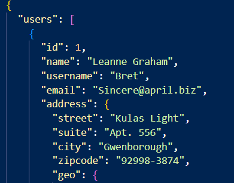
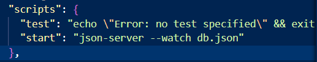

<h1>Json server, Api rest fake</h1>

 Con node js descargado, en una carpeta en el terminal se digita:
 
<code> npm init -y

 con esto se inicializa un proyecto con node, seguido a esto se instala el paquete de json server

<code> npm install -g json-server

 

 se creará un archivo json en el cual tendremos los datos a forma de diccionarios, para json server funcione se tiene que guardar el diccionario dentro de un objeto

 ahora podremos correr el servidor con el siguiente comando

<code>json-server --watch db.json

se correrá el server y se dará la ruta a la cual le podremos hacer consultas de GET, POST, PUT, etc

<h2>Script para inicio

 dentro del package, se podrá definir un script para que al momento de llamarlo por consola, se inicialice el server, de la siguiente forma:

 de esta forma podremos inicializar el server con el codigo

<code>npm start

<h2>Cambio de puerto

 para ejecutarse en otro puerto colocaremos el siguiente codigo

<code>json-server --watch db.json --port 800
